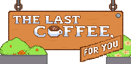

  

# ☕ The Last Coffee, For You
*Will you share one last cup… or let the moment slip away forever?*  

You never know when a conversation will be your last.  
Will you say your goodbyes before it's too late?  
Will you reconnect before the distance becomes permanent?  
Or will you live with the quiet ache of knowing  
that your final moment together has already passed?  

This is a branching, open-ended experience about fleeting connections, unspoken words, and the warmth (and bitterness) of coffee shared in silence.  
_(Proper game description coming when I feel like writing one… there’s already one on my GitHub page anyway.)_  

---

## 💡 Behind the Idea
Weirdly enough, three people with *really* similar names inspired this.  
They left, one way or another — and with them went the certainty of tomorrow.  

Regret.  
Longing.  
The quiet ache of "things I could have done better."  

Coffee in this game is more than a drink —  
it’s a symbol of connection:  
Familial, platonic, or romantic.  
Every sip is a chance to bridge the gap… or let it widen.  

---

## 🎵 *The Coffee I Brewed for You*  
_(Regretful little song snippet from the heart.)_  

> One day, you'll get tired of the coffee,  
> Tired of the monotony of the same old story.  
> A latte with some toffee, a fresh cold brew —  
> The same flavors you once called "mine,"  
> a cup of some time?  
>   
> I'd like to think we'll collide one day,  
> We'll share a coffee along the way.  
> Oh, I'll make a cup of ol’ times for you,  
> The memories we'll share once we're through.  
> The same flavors you called "mine," a cup of some time?  
> Will there be a next time…  
> or was this our last… time…  

---

### 🎮 Status
- Branching narrative framework ✅  
- Core theme brewing ☕  
- Emotional damage in progress 💔  

---

<i>Sometimes, the cup grows cold before you even take a sip.</i>

